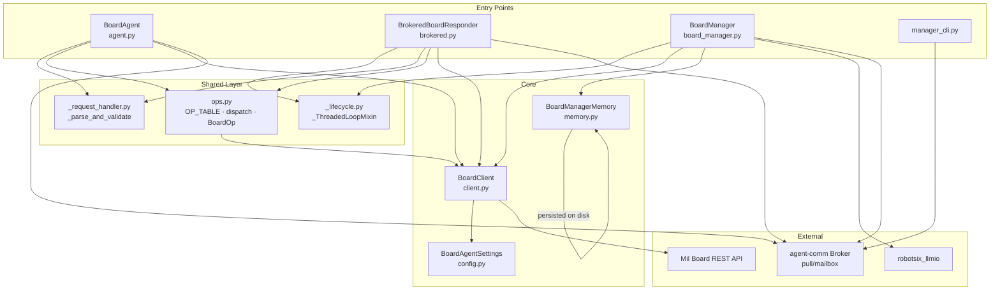

# Architecture Overview

This document is the entry point for understanding the **robotsix-board-agent**
codebase — how the modules fit together, how requests flow through the system,
and where to look for deeper detail.

---

## Module dependency diagram



## Two-tier architecture

The system provides **two tiers** of board interaction, sharing the same
`BoardClient` HTTP layer and agent-comm broker connectivity but differing
in how they interpret incoming requests:

| | **BrokeredBoardResponder** | **BoardManager** |
|---|---|---|
| **Interaction style** | Structured RPC | Natural-language conversation |
| **Input shape** | `{"op": "list_tickets", "args": {...}}` | `{"message": "show me open PRs"}` |
| **Output** | Raw board API dict | Conversational reply (LLM-generated) |
| **LLM** | None | Two-stage: recall scan + tool-using agent |
| **Memory / history** | None | `BoardManagerMemory` — persisted traces + notes |
| **Write access** | Gated by `enable_write_ops` config | Always available (tools include writes) |
| **Use case** | Programmatic access (CI, agent-to-agent) | Human chat interface |
| **Agent id** | `board-{repo_id}` | `board-manager-{repo_id}` |

Both tiers are backed by the same `BoardClient` (the **sole** module that
speaks to the Mil board REST API) and both register with the agent-comm
broker in pull/mailbox mode via `_ThreadedLoopMixin`.

Additionally, the **`BoardAgent`** class (`agent.py`) is a legacy async
entry point that uses the same structured-op dispatch but wraps the
agent-comm `Agent` directly (no mixin). It is the original integration
and remains available, though the brokered responder is preferred for new
structured-op deployments. See [request path 3](#3-structured-operation--boardagent-legacy)
below for its flow.

---

## Two request paths

### 1. Structured operation → `BrokeredBoardResponder`

```
Incoming broker message (JSON)
        │
        ▼
_parse_and_validate(request, settings)      ← _request_handler.py
  ├─ BoardOp.model_validate(body)           ← pydantic model
  ├─ Check op ∈ OP_TABLE                    ← unknown op → UNKNOWN_OP error
  └─ Check enable_write_ops gate            ← write op denied → WRITE_OPS_DISABLED error
        │
        ▼
dispatch(client, op)                        ← ops.py
  ├─ OP_TABLE[op.op] → handler function     (e.g. _list_tickets)
  ├─ Validate args against typed args model (e.g. ListTicketsArgs)
  └─ Call client.xxx()                      → BoardClient HTTP call
        │
        ▼
Response.to(request, body=result)
```

All of this happens on a dedicated `asyncio` event loop running on a
daemon thread (`_ThreadedLoopMixin`). The `_handle_request` callback
is synchronous from the broker's perspective; it uses `self._run(coro)`
to bridge into the event loop.

### 2. Natural-language request → `BoardManager._converse`

```
Incoming broker message (natural language)
        │
        ▼
BoardManager._handle_request
  └─ Extract "message" from body
        │
        ▼
BoardManager._converse(question, requester)
  │
  ├─ Stage 1 — Recall scan (if conversation history exists)
  │   ├─ Builds lightweight LLM agent (level=1) with _RECALL_SYSTEM
  │   ├─ Feeds: full conversation history + current question
  │   └─ Output: list of relevant prior exchange excerpts
  │
  ├─ Stage 3 — Acting manager
  │   ├─ Builds tool-using LLM agent (level=3) with _MANAGER_SYSTEM
  │   ├─ Context: curated memory notes + relevant prior exchanges
  │   ├─ Tools: 15 board operations + update_memory
  │   │         (each tool wraps a self._run(client.xxx()) call)
  │   └─ Runs h3.run_sync(question) → LLM replies in natural language
  │
  ├─ Append Q→A pair to memory (conversation trace + maintained notes)
  └─ Return Response.to(request, body={"reply": answer})
```

The `BoardManager`'s tools are the structured ops from `ops.py` but
called indirectly through `BoardClient` methods. The LLM decides which
tool to use and with what arguments — the manager never calls
`_parse_and_validate` or `dispatch` directly.

### 3. Structured operation → `BoardAgent` (legacy)

```
Incoming message (from Registry callback)
        │
        ▼
BoardAgent._handle
  └─ _parse_and_validate(request, settings)   ← _request_handler.py
        │
        ▼
  dispatch(client, op)                        ← ops.py
        │
        ▼
  Return result dict (or error) to caller
```

`BoardAgent` follows the same `_parse_and_validate` → `dispatch` path as
`BrokeredBoardResponder` but does **not** use `_ThreadedLoopMixin` — it
wraps `agent_comm.Agent` directly and is fully async. This is the original
integration and remains available for backward compatibility.

---

## Key components in detail

### `BoardClient` (`client.py`)

The **only** module that makes HTTP calls to the Mil board REST API.
Every public method maps 1:1 to a board endpoint (`list_tickets`,
`get_ticket`, `create_ticket`, `comment`, `transition`, …). It accepts a
`BoardAgentSettings` instance for configuration and supports transport
injection for testability. All other modules depend on `BoardClient`.

### `_ThreadedLoopMixin` (`_lifecycle.py`)

A mixin that provides a daemon-thread lifecycle for broker-backed agents.
On `start()`, it creates an `asyncio` event loop on a background thread,
starts the agent-comm broker, and provides `_run(coro)` to bridge sync
callbacks into the event loop. On `stop()`, it closes the client and
joins the thread. Used by both `BrokeredBoardResponder` and `BoardManager`.

### `_parse_and_validate` (`_request_handler.py`)

A shared structured-op parser used by `BoardAgent` and
`BrokeredBoardResponder`. It deserializes the JSON body into a `BoardOp`,
validates the op name against `OP_TABLE`, and enforces the write gate
when `enable_write_ops` is disabled.

### `ops.py`

The canonical op registry. Defines:
- `BoardOp` — pydantic model for incoming structured requests
- `OP_TABLE` — mapping of op name → handler function
- `WRITE_OPS` — set of op names that modify board state
- Per-op argument models (pydantic, e.g. `ListTicketsArgs`)
- Handler functions that validate args and call `BoardClient`
- `dispatch(client, op)` — top-level entry point

### `BoardManagerMemory` (`memory.py`)

Two-track persistence for `BoardManager`:
- **Conversation trace** — timestamped Q→A pairs stored as JSON, capped at 200 entries, oldest-first pruning on overflow.
- **Maintained memory note** — a Markdown document the LLM can read and update via the `update_memory` tool, capped at 8,000 characters.

### `BoardAgentSettings` (`config.py`)

A plain Pydantic `BaseModel` (not `BaseSettings`) that holds:
- `board_api_url` — base URL of the Mil board REST API
- `board_api_token` — authentication token
- `board_repo_id` — the target repository
- `enable_write_ops` — boolean flag that gates write operations

All agents and `BoardClient` accept this model at construction time.

---

## Module taxonomy manifest

`docs/modules.yaml` is a machine-readable taxonomy of every module in the
project. It maps each module to its source files, documentation page, and
test directory, with a one-line description. The `module_curator` periodic
workflow validates this manifest against the live directory tree to catch
drift — files that move, get renamed, or are added without a taxonomy entry.

When adding new source files, tests, or documentation pages, register them
in `docs/modules.yaml` under the appropriate module entry and run:
```bash
uv run --frozen robotsix-modules check-registration docs/modules.yaml
```

---

## Per-module deep dives

| Module | Documentation | What it covers |
|---|---|---|
| **agent** | [`docs/agent/getting-started.md`](agent/getting-started.md) | Quickstart: install, configure, send structured ops |
| **brokered** | [`docs/brokered/responder.md`](brokered/responder.md) | `BrokeredBoardResponder` — producer-side structured-op entry point |
| **board_manager** | [`docs/board_manager/api.md`](board_manager/api.md) | LLM-powered conversational manager, tools, two-stage pipeline |
| **client** | [`docs/client/api.md`](client/api.md) | `BoardClient` typed HTTP methods and error handling |
| **config** | [`docs/config/reference.md`](config/reference.md) | `BoardAgentSettings` model fields |
| **ops** | [`docs/ops/operations.md`](ops/operations.md) | Canonical op table (15 ops), `{"op": …}` protocol, error codes |
| **memory** | [`docs/memory/reference.md`](memory/reference.md) | `BoardManagerMemory` persistence model |
| **manager_cli** | [`docs/manager_cli/usage.md`](manager_cli/usage.md) | CLI tool for talking to a `BoardManager` |
| **API reference** | [`docs/reference.md`](reference.md) | Auto-generated API reference from docstrings |

---

## File layout

```
src/robotsix_board_agent/
├── __init__.py             # Re-exports public symbols
├── _lifecycle.py           # _ThreadedLoopMixin (daemon loop)
├── _request_handler.py     # _parse_and_validate (op parser + write gate)
├── agent.py                # BoardAgent (async legacy entry point)
├── board_manager.py        # BoardManager (NL→ops LLM agent)
├── brokered.py             # BrokeredBoardResponder (structured-op broker entry)
├── client.py               # BoardClient (typed HTTP client)
├── config.py               # BoardAgentSettings (pydantic model)
├── constants.py            # BoardErrorCode enum, defaults
├── manager_cli.py          # CLI entry point
├── memory.py               # BoardManagerMemory (conversation + notes)
└── ops.py                  # OP_TABLE, dispatch, per-op handlers + arg models
```
